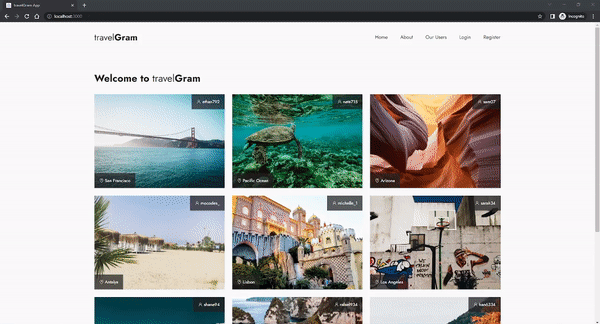
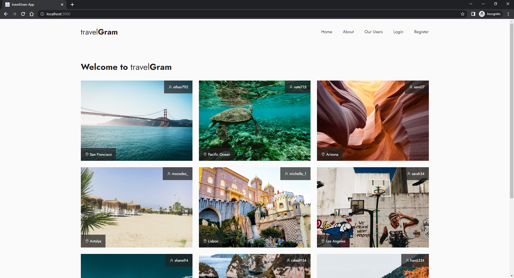
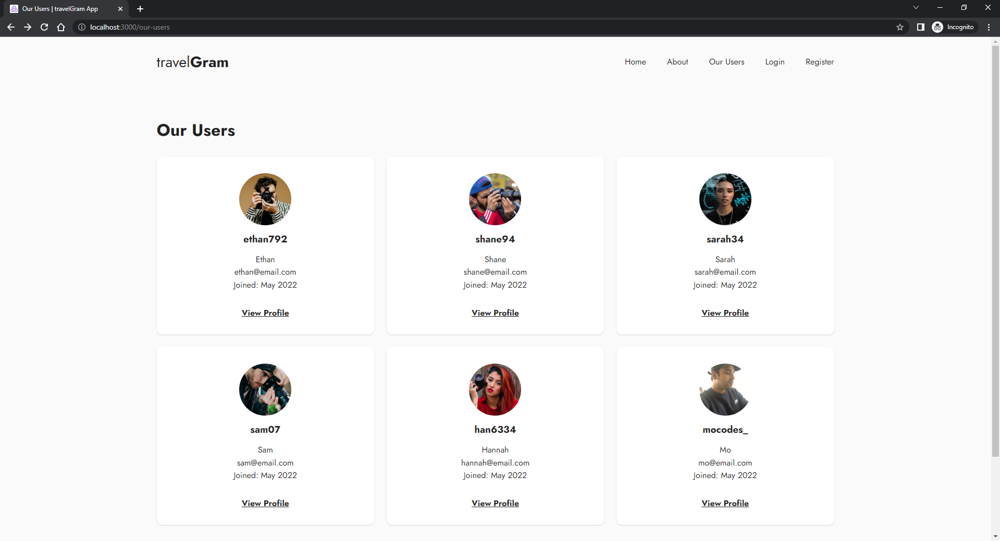
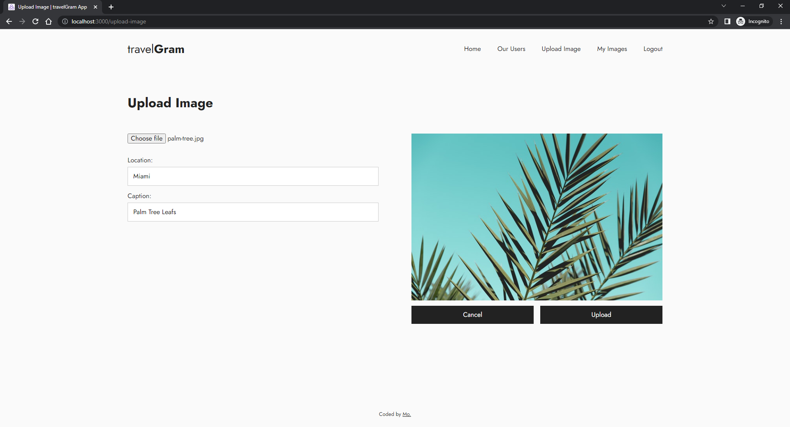
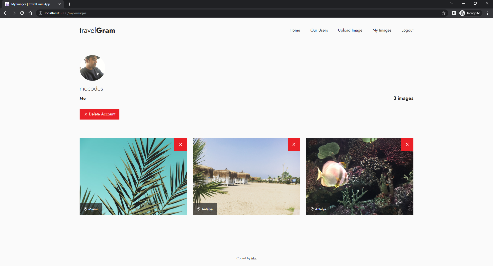

# travelGram

An app for people to upload and share their travel photos. This app was built using the MERN stack. - [View App](https://travelgram-app-mocodes.herokuapp.com/)

Users can:

- Register an account or login (Credentials stored in MongoDB)
- Upload images
- Delete images
- View all images
- View all users
- Share a users profile
- Delete account

The images are stored in MongoDB with Express and Node.js being used to power the backend. React & Redux along with Styled Components was used to build and style the frontend. HTTP requests are made from the frontend using Axios. The React Testing Library was also used to test the pages and components of the application.

Note: The images uploaded to the app were downloaded from [Pexels](https://www.pexels.com/).

## Table of contents

- [Screenshots](#screenshots)
- [Technologies](#technologies)
- [Languages](#languages)
- [Future development plans](#features-for-future-development)
- [Contact](#contact)

## Screenshots

## Technologies

- React
- React Hooks, React Router, React Testing Library
- Redux
- Axios
- MongoDB
- Node.js and NPM
- Express
- Styled Components
- Postman
- Git & GitHub
- Visual Studio Code (IDE)

## Languages

- JavaScript

## Features for future development

- Update user profile details
- 'Like image' button

## Contact

Coded by Mo - [mocodes](https://mocodes.co.uk/)

Twitter: [@mocodes\_](https://twitter.com/mocodes_)
